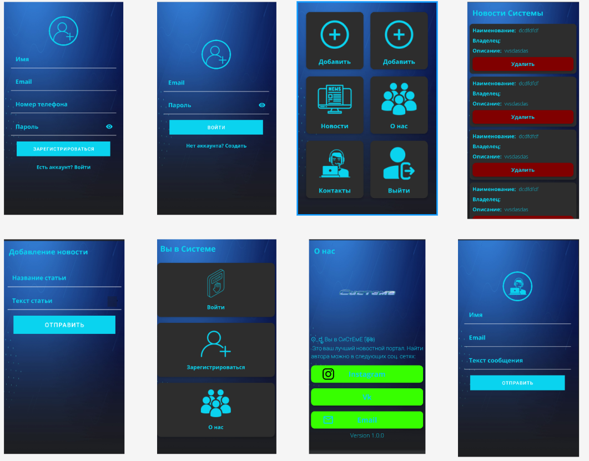

#  Мобильное приложение "Новостной портал" на Android + Java
[)](https://github.com/bychkovmax/mobile-app)

Проект является "Коробочной" версией "Новостного портала". Он легко интегрируем под любую тематику ИС, а также, может быть переделан под "Таск лист".

[](https://github.com/bychkovmax/mobile-app)

Postgres 14

Параметры подключения:

    DB_HOST: localhost
    DB_PORT: 6666
    DB_NAME: android
    DB_USER: android
    DB_PASS: android
[](https://github.com/bychkovmax/mobile-app)

Для запуска PostgreSQL в докер-контейнере нужно создать два файла: .env 
Он отсутствуют в кодовой базе проекта (git) по причине содержания в них персональных настроек соединения с БД.

Для их создания есть два способа:

1. Выполнить команду ./dpg.sh --setup и ответить на вопросы помощника. Пример выполнения команды:

```shell
./dpg.sh --setup
Файл flyway.conf уже существует, переписать его? N/y:y
  > DB Host [localhost]: 
  > DB Port [6666]: 
  > DB Name [android]: 
  > DB Schemas [public]: 
  > DB User [android]: 
  > DB Password [android]: 

Файл .env успешно создан.
Файл flyway.conf успешно создан.
```

2. Создать файлы "руками", используя примеры .env.sample соответственно

После этого можно поднять контейнер с БД:

```shell
docker-compose up --build -d db
```

[](app/src/main/res/drawable/UI.png)



[](app/src/main/res/drawable/demo.gif)

